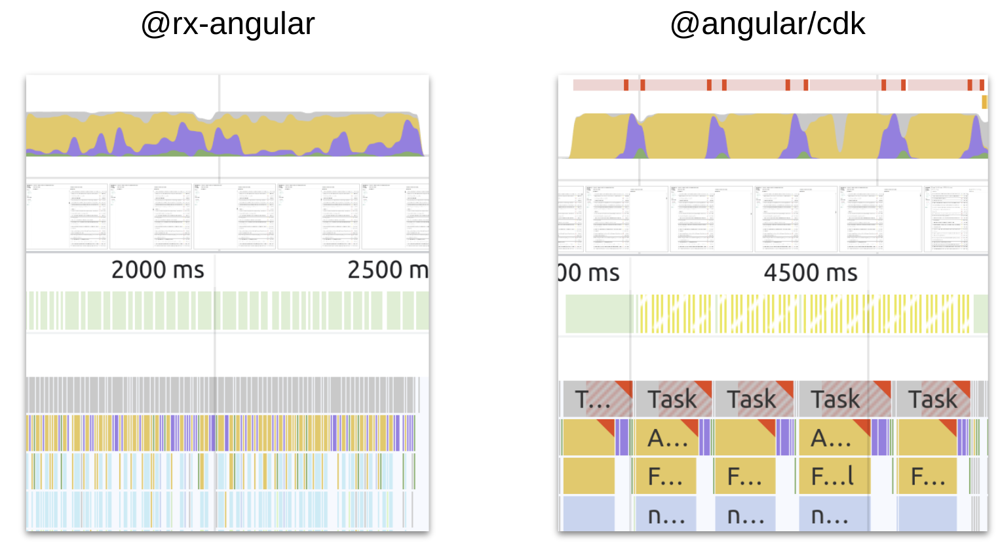

# RxAngular Virtual Scrolling Playground

> This is a playground/development repository. It served to test out ideas and concepts. It also hosts a demo application

> The code you see here is the latest version of the currently existing [PR](https://github.com/rx-angular/rx-angular/pull/1539) on rxa, just copied over to serve the demo with the latest version.

# RxAngular Virtual Scrolling

A **high performance** alternative to [`@angular/cdk/scrolling`](https://material.angular.io/cdk/scrolling/) virtual scrolling implementation.



Instead of rendering every item provided, `rxVirtualFor` only renders what is currently visible to the user, thus providing
excellent runtime performance for huge sets of data.

The technique to render items is comparable to the one used by twitter and
explained in great detail by @DasSurma in his blog post about the
[complexities of infinite scrollers](https://developer.chrome.com/blog/infinite-scroller/).

"Each recycling of a DOM element would normally relayout the entire runway which would bring us well below our target
of 60 frames per second. To avoid this, we are taking the burden of layout onto ourselves and use absolutely positioned
elements with transforms." [(@DasSurma)](https://twitter.com/dassurma)

> **⚠ Notice:**
> This package is currently experimental, the public API can potentially change

The `@rx-angular/template/experimental/virtual-scrolling` package is a high performant alternative of the official `@angular/cdk/scrolling`.
The API is heavily inspired by `@angular/cdk/scrolling` and is divided into multiple
core components which have to be glued together:

- `RxVirtualViewRepeater`, implemented by `RxVirtualFor`
- `RxVirtualScrollViewport`, implemented by `RxVirtualScrollViewportComponent`
- `RxVirtualScrollStrategy`, implemented by `AutosizeVirtualScrollStrategy`, `

# TOC

[//]: # '* [Installation](#installation)'

- [Usage](#usage)
- [Demo](#demo)
- [Features](#features)
- [Performance Benchmarks](#performance-benchmarks)

## Usage

```ts
import {
  FixedSizeVirtualScrollStrategy, // choose any strategy you like
  RxVirtualScrollViewportComponent,
  RxVirtualFor,
} from '@rx-angular/template/experimental/virtual-scrolling';

@Component({
  standalone: true,
  imports: [RxVirtualFor, RxVirtualScrollViewportComponent, FixedSizeVirtualScrollStrategy],
})
export class MyComponent {}
```

```html
<rx-virtual-scroll-viewport>
  <div [itemSize]="50" *rxVirtualFor="let hero of heroes$;">
    <div>
      <div><strong>{{ hero.name }}</strong></div>
      <div>{{ hero.id }}</div>
      <div>{{ hero.description }}</div>
    </div>
  </div>
</rx-virtual-scroll-viewport>
```

## Demo

Check out the [Demo Application](https://hoebbelsb.github.io/rxa-virtual-scroll/). You can play around with
all pre-packaged ScrollStrategies as well as control the majority of inputs.

## Features

**DX Features**

- reduces boilerplate (multiple `async` pipe's)
- works also with static variables `*rxVirtualFor="let i of myData"`
- Immutable as well as mutable data structures (`trackBy`)
- Notify when rendering of templates is finished (`renderCallback`)

**Performance Features**

- lazy template creation (done by [Render Strategies](https://www.rx-angular.io/docs/cdk/render-strategies))
- non-blocking rendering of lists [Concurrent Strategies](https://www.rx-angular.io/docs/cdk/render-strategies/strategies/concurrent-strategies)
- configurable frame budget (defaults to 60 FPS)
- Super efficient layouting with css transformations
- Scoped layouting with css containment
- Define a viewCache in order to re-use views instead of re-creating them
- triggers change-detection on `EmbeddedView` level
- Zone-agnostic, opt-out of `NgZone` with `patchZone`
- 3 Configurable `RxVirtualScrollStrategy` providing the core logic to calculate the viewRange and position DOM
  Nodes
  - [`FixedSizeVirtualScrollStrategy`](#fixedsizevirtualscrollstrategy)
  - [`DynamicSizeVirtualScrollStrategy`](#dynamicsizevirtualscrollstrategy)
  - [`AutoSizeVirtualScrollStrategy`](#autosizevirtualscrollstrategy)

# Performance Benchmarks

As this library is a direct competitor of [`@angular/cdk/scrolling`](https://material.angular.io/cdk/scrolling/overview),
this section discusses not only performance differences, but also feature availability.

Performance recordings are taken from the [Demo Application](https://hoebbelsb.github.io/rxa-virtual-scroll/).
The demo application by default displays lists of `30 000` items.

The scenario that was benchmarked here is scrolling over long distances by using the scroll bar. This scenario
puts the most pressure on the virtual scrollers.

## System Setup

|           |                                                            |
| --------- | ---------------------------------------------------------- |
| OS        | `Pop!_OS 22.04 LTS`                                        |
| Browser   | `Chromium Version 112.0.5615.49 (Official Build) (64-bit)` |
| Processor | `Intel® Core™ i7-9750H CPU @ 2.60GHz × 12`                 |

## Different Layout techniques

The RxVirtualScrolling approach to layout items is to absolutely position every view inside the viewport. Therefore, it sets the `transform` property for each managed item.
The CDK approach instead transforms the viewport. The following video showcases the difference.

https://user-images.githubusercontent.com/4904455/231340169-f65efe6c-863d-49e8-9f4f-183bb38e1b2a.mp4

## Fixed Size Strategy

Comparison between [RxAngular FixedSizeVirtualScrollStrategy](#fixedsizevirtualscrollstrategy) and [CdkFixedSizeVirtualScroll](https://material.angular.io/cdk/scrolling/api#CdkFixedSizeVirtualScroll).

[FixedSizeVirtualScrollStrategy comparison Demo](https://hoebbelsb.github.io/rxa-virtual-scroll/#/demos/fixed-size-cdk-compare)

### Features

| Feature           | `@rx-angular-addons/virtual-scrolling` | `@angular/cdk/scrolling` |
| ----------------- | -------------------------------------- | ------------------------ |
| `scrolledIndex$`  | ✅                                     | ✅                       |
| `scrollToIndex()` | ✅                                     | ✅                       |

### Performance

**No throttling**

Both solutions do fine without throttling. But, the `CdkFixedSizeVirtualScroll` already struggles with the frame rate. We can already spot `partially presented frames`.
Also, the javascript tasks are taking longer compared to the `RxAngular FixedSizeVirtualScrollStrategy`.

| `@rx-angular-addons/virtual-scrolling`                                          | `@angular/cdk/scrolling`                                                        |
| ------------------------------------------------------------------------------- | ------------------------------------------------------------------------------- |
|  |  |

**4x CPU throttling**

With throttling enabled, the `CdkFixedSizeVirtualScroll` already struggles a lot with keeping the frame rate above anything reasonable. Javascript tasks take up to ~160ms (long-tasks) and
the amount of `partially presented frames` increases.
The `RxAngular FixedSizeVirtualScrollStrategy` has no issues whatsoever keeping the frame rate above 30fps on 4x times throttling.

| `@rx-angular-addons/virtual-scrolling`                                      | `@angular/cdk/scrolling`                                                    |
| --------------------------------------------------------------------------- | --------------------------------------------------------------------------- |
|  |  |

## Dynamic Size Strategy

Comparison between [RxAngular DynamicSizeVirtualScrollStrategy](#dynamicsizevirtualscrollstrategy) and [CDK AutoSizeVirtualScrollStrategy](https://github.com/angular/components/blob/main/src/cdk-experimental/scrolling/auto-size-virtual-scroll.ts).
As there is no real counterpart to the `DynamicSizeVirtualScrollStrategy`, the comparison was made against the `CDK AutoSizeVirtualScrollStrategy`. This is scroll behavior wise the most comparable
implementation from the cdk package.

[DynamicSizeVirtualScrollStrategy comparison Demo](https://hoebbelsb.github.io/rxa-virtual-scroll/#/demos/dynamic-size-cdk-compare)

### Features

As an experimental package, the `CDK AutoSizeVirtualScrollStrategy` does not emit the current scrollIndex, nor has it a working `scrollToIndex` method implemented.
The `RxAngular DynamicSizeVirtualScrollStrategy` is able to do both! It emits the current valid scrolledIndex and is able to properly scroll to the
correct position based on an index.

| Feature           | `@rx-angular-addons/virtual-scrolling` | `@angular/cdk/scrolling` |
| ----------------- | -------------------------------------- | ------------------------ |
| `scrolledIndex$`  | ✅                                     | ❌                       |
| `scrollToIndex()` | ✅                                     | ❌                       |

### Performance

**No throttling**

Both solutions do fine without throttling. But, the `CDK AutoSizeVirtualScrollStrategy` struggles with the frame rate. We can already spot lots of `partially presented frames`.
The `RxAngular DynamicSizeVirtualScrollStrategy` implementation easily maintains a stable framerate around 45fps.

| `@rx-angular-addons/virtual-scrolling`                                                  | `@angular/cdk/scrolling`                                                        |
| --------------------------------------------------------------------------------------- | ------------------------------------------------------------------------------- |
|  |  |

**4x CPU throttling**

With throttling enabled, the `CDK AutoSizeVirtualScrollStrategy` struggles a lot with keeping the frame rate above anything reasonable. Javascript tasks take up more than ~160ms (long-tasks) and
the amount of `partially presented frames` increases.
The `RxAngular DynamicSizeVirtualScrollStrategy` has no issues whatsoever keeping the frame rate above 30fps on 4x times throttling. The javascript execution time is still very low, the style
recalculations and layouting phases are increasing, though. This will also depend very much on the actual use case.

| `@rx-angular-addons/virtual-scrolling`                                              | `@angular/cdk/scrolling`                                                    |
| ----------------------------------------------------------------------------------- | --------------------------------------------------------------------------- |
|  |  |

## Autosize Strategy

Comparison between [RxAngular AutosizeVirtualScrollStrategy](#autosizevirtualscrollstrategy) and [CDK AutoSizeVirtualScrollStrategy](https://github.com/angular/components/blob/main/src/cdk-experimental/scrolling/auto-size-virtual-scroll.ts).

[AutosizeVirtualScrollStrategy comparison Demo](https://hoebbelsb.github.io/rxa-virtual-scroll/#/demos/autosize-cdk-compare)

### Features

As an experimental package, the `CDK AutoSizeVirtualScrollStrategy` does not emit the current scrollIndex, nor has it a working `scrollToIndex` method implemented.
The `RxAngular AutosizeVirtualScrollStrategy` is able to do both! It emits the current valid scrolledIndex and is able to properly scroll to the
correct position based on an index.

| Feature           | `@rx-angular-addons/virtual-scrolling` | `@angular/cdk/scrolling` |
| ----------------- | -------------------------------------- | ------------------------ |
| `scrolledIndex$`  | ✅                                     | ❌                       |
| `scrollToIndex()` | ✅                                     | ❌                       |

### Performance

**No throttling**

For the `CDK AutoSizeVirtualScrollStrategy`, the same is true as for the comparison vs. the `DynamicSizeVirtualScrollStrategy`.
The `RxAngular AutoSizeVirtualScrollStrategy` implementation easily maintains a stable framerate of 60fps. You see the reason why it can maintain this framerate in the
comparison flameshots. The AutoSizeVirtualScrollStrategy puts all the layouting work into the RxAngular scheduler queue which will keep the framebudget for us.
For each inserted view, the `AutoSizeVirtualScrollStrategy` will cause a forced reflow as it immediately reads its dimensions. It sounds like a disadvantage, but in reality
the scrolling performance benefits from this approach. Anyway, that's why we such heavy `rendering` peaks (purple color).
Nodes that were visited once are not queried again, scrolling the same path twice will differ in runtime performance. All consequent attempts should be as fast as the fixed or dynamic
size implementations.

| `@rx-angular-addons/virtual-scrolling`                                          | `@angular/cdk/scrolling`                                                        |
| ------------------------------------------------------------------------------- | ------------------------------------------------------------------------------- |
|  |  |

**4x CPU throttling**

For the `CDK AutoSizeVirtualScrollStrategy`, the same is true as for the comparison vs. the `DynamicSizeVirtualScrollStrategy`.

Even with 4x CPU throttling enabled, the `RxAngular AutoSizeVirtualScrollStrategy` keeps a reasonable frame rate and only sometimes produces partially presented frames.
Thanks to the concurrent strategies, users will never encounter long tasks while scrolling.

| `@rx-angular-addons/virtual-scrolling`                                      | `@angular/cdk/scrolling`                                                    |
| --------------------------------------------------------------------------- | --------------------------------------------------------------------------- |
|  |  |
